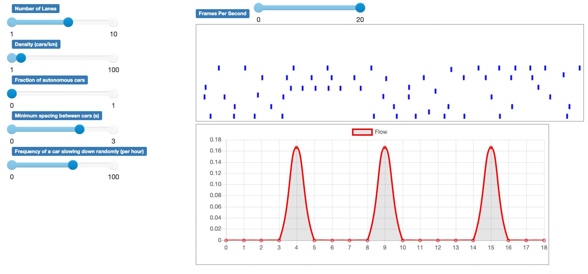

# Traffic flow model
An Agend-Based Model (ABM) used to study the emergence of traffic jams on highways.

</img>

# Setup

### Using `make`

Make sure that `pip`/`pip3` is installed (python version >= 3.6).
On Mac or Linux run the following commands in your terminal. On Windows you may have to install [make](http://gnuwin32.sourceforge.net/packages/make.htm) for PowerShell .

```
git clone https://github.com/voschezang/ABM
cd ABM
make deps
```


### (Alternative) Manual setup

Install all packages listed in `requirements.txt`. Shortcut: `pip3 install -r requirements.txt`


# Run simulation

Start server and run a simulation in your browser
```
make run
```

### (Alternative) Manually run progam

Use an IDE or, depending on your python installation, use one of
```
python3 run.py
python run.py
pythonw run.py
```

## Run analysis

Open `analysis.ipynb` with jupyter notebook.


# Basic agent rules
### Nagel-Schreckenberg rules
- Accelerate if agent is not driving at maximum speed
- Slow down if another car is in front of agent (within range)
- Disable backwards movement

### Extended rules
- Overtake any car in front of agent (if possible)
- else, go to right lane (if possible)

